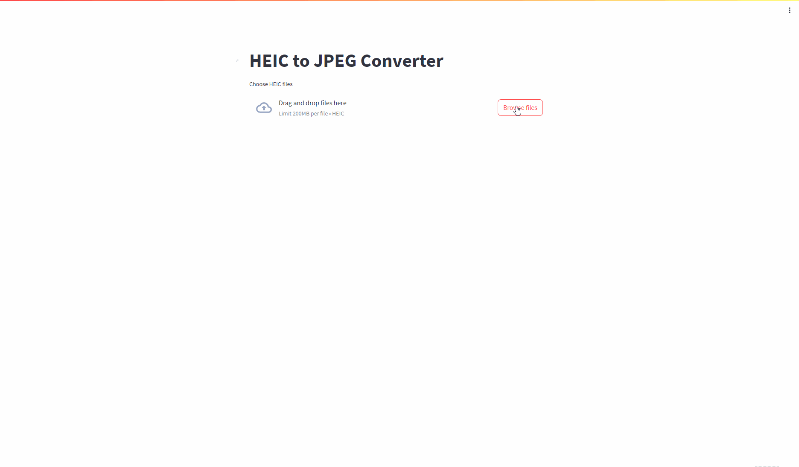

# heic converter

`.heic`拡張子の画像をJpegに変換するツール



## Env

- Ubuntu 20.04
- Python 3.8.10

## Requirements

- streamlit
- pyheif
- pillow

## Usage

```bash
# optional
python -m venv .venv
source .venv/bin/activate
streamlit run app.py
```
